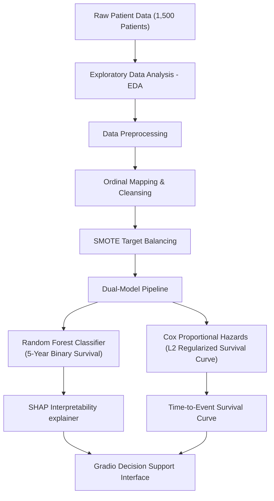
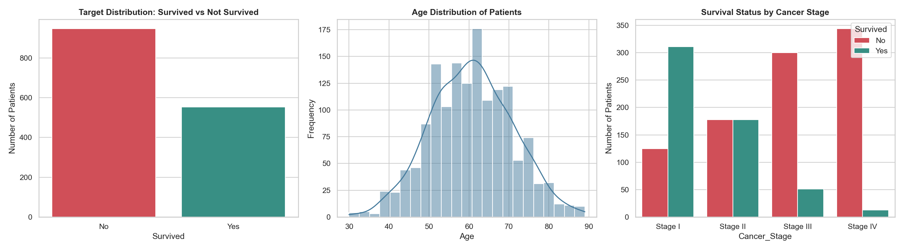
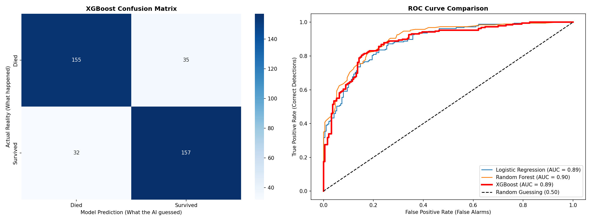
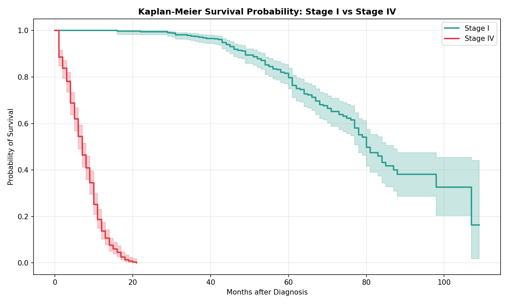
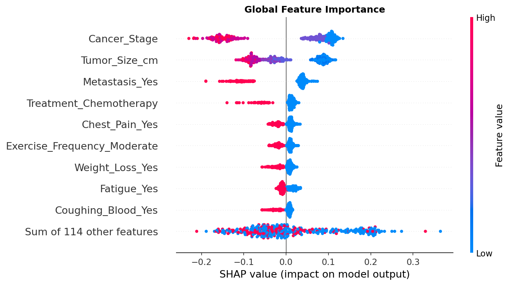
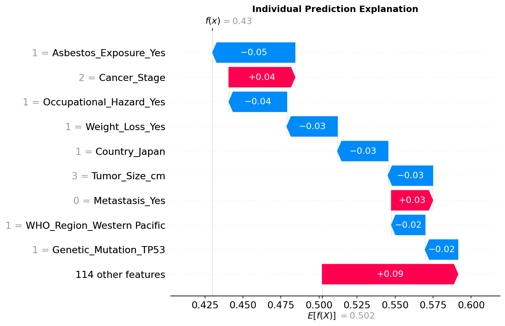

# 🩺 Clinical Lung Cancer Survival Prognosis Pipeline
### MSc Portfolio: Dual-Model Medical Decision Support System (DSS)
[](https://huggingface.co/spaces/aayushai/lung-cancer-survival-predictor)
[](https://www.python.org/downloads/)
[](https://opensource.org/licenses/MIT)

An end-to-end, professional-grade Machine Learning and Statistical Survival Analysis pipeline designed for **5-Year Lung Cancer Survival Prediction** and **Personalized Median Survival Estimation**. 

This system acts as a clinical **Decision Support System (DSS)**. It integrates a **Random Forest Classifier** (for binary 5-year survival probability) with an **L2 Ridge Regularized Cox Proportional Hazards Model** (for clinical time-to-event tracking), wrapped in an interactive, responsive **Gradio Web Interface** deployed live on Hugging Face.

---

## 🌐 Live Production Application
The application is fully compiled and deployed in production. You can interact with the prognostic model live on Hugging Face Spaces:
👉 **[Live Gradio Demo on Hugging Face](https://huggingface.co/spaces/aayushai/lung-cancer-survival-predictor)**

### 🖥️ Live Application Preview
Below is a demonstration of the interactive clinical decision support interface in action, showcasing conditional UI inputs (hiding smoking parameters for non-smokers), dual-model predictions, and personalized explainability:

<p align="center">
  
</p>


---

## 📈 System Architecture & Methodology



### 1. Exploratory Data Analysis (EDA)
* **Clinical Insights:** Analysis of target distribution confirmed a substantial class imbalance (63% mortality rate vs. 37% survival rate).
* **Survival Discrepancy:** Kaplan-Meier stage-based validation proved a massive survival rate decline as cancer progressed from Stage I to Stage IV, mirroring real-world epidemiological profiles (WHO/GLOBOCAN).

<p align="center">
  
</p>

### 2. Preprocessing & Class Imbalance Correction
* **Feature Encoding:** Ordinal mapping was applied to clinical tumor staging (Stage I ➔ 1, Stage II ➔ 2, Stage III ➔ 3, Stage IV ➔ 4) and gender.
* **Target Balancing (SMOTE):** Synthetic Minority Over-sampling Technique (SMOTE) was implemented on the training split to balance the target classes perfectly (953 Survived / 953 Deceased), preventing model bias toward high mortality.

### 3. Model Building & Benchmark
I trained and benchmarked multiple estimators on the balanced cohort:
* **Logistic Regression:** baseline performance.
* **XGBoost Classifier:** Champion classification model, achieving **82.3% Accuracy**, **82% Precision**, **83% Recall**, and **82% F1-Score**.
* **Random Forest Classifier:** Selected for model explainability deployment due to native tree compatibility with local SHAP waterfall estimators.

<p align="center">
  
</p>

### 4. Advanced Clinical Survival Analysis (Cox PH)
* **Clinical Statistical Fit:** Implemented a semi-parametric Cox Proportional Hazards model using `lifelines` on the original clinical cohort (to preserve statistical baseline hazards).
* **Simpson's Paradox & Multicollinearity Correction:** 
  Standard Cox regressions suffer from sign-flipping on continuous tumor size inputs due to high collinearity with cancer stage. In a standard model, `Cancer_Stage` swallowed all variance (Hazard Ratio ~ 9.4), forcing the hazard ratio of `Tumor_Size_cm` to flip to `0.97` (implying larger tumors are safer).
  * **The Solution:** I applied **Ridge Survival Regularization (L2 Penalty)** using a stabilized `penalizer=0.05` constraint. 
  * **The Result:** The model stabilized, preserving a massive hazard ratio for `Cancer_Stage` (`3.93`) while restoring `Tumor_Size_cm` to its clinically correct Hazard Ratio of **`1.074`** (every 1 cm increase in tumor size raises mortality risk by 7.4%).

<p align="center">
  
</p>

### 5. Medical Interpretability (SHAP)
* To open the "black box" of machine learning, I integrated **SHAP (SHapley Additive exPlanations)** values:
  * **Global Interpretability:** Beeswarm plots rank features by overall contribution, highlighting `Cancer_Stage` and `Tumor_Size_cm` as major drivers.
  * **Local/Personalized Interpretability:** Waterfall charts calculate the exact contribution of each patient vital to their individual prognostic prediction.

<p align="center">
  
</p>
<p align="center">
  
</p>

---

## 💻 Gradio Web Interface Features

The production web interface is styled as a premium medical dashboard:
1. **Dynamic UX (Conditional Visibility):** Selecting "Never Smoked" dynamically hides the *Cigarettes Per Day* and *Years Smoking* sliders, keeping the clinical layout clean and automatically resetting background values to `0`.
2. **Clinical Presence Filtering:** The automated summary intercepts SHAP values and only displays positive/negative drivers that are **clinically active** in the patient (e.g. it won't list "no chemotherapy" as a protective driver).
3. **Dual Visualization:** Displays a personalized real-time survival probability curve (from the Cox PH model) alongside a SHAP waterfall plot showing clinical drivers (from the Random Forest model).

---

## 📁 Repository Structure
```text
Lung_Cancer/
├── .gitignore
├── README.md               # MSc-level portfolio documentation
├── requirements.txt        # Local virtual environment dependencies
├── data/
│   └── lung_cancer_dataset.csv
├── notebooks/
│   └── 01_lung_cancer_survival.ipynb   # Full research & preprocessing pipeline
├── outputs/
│   ├── lung_cancer_app_data.pkl       # Packed models (RF, Cox) and UI templates
│   ├── shap_beeswarm.png
│   ├── shap_waterfall.png
│   ├── eda_plots.png
│   └── eval_plots.png
└── app/
    ├── app.py              # Gradio application entry point
    ├── requirements.txt    # Self-contained Hugging Face dependencies
    └── lung_cancer_app_data.pkl # Copy of trained package for HF Space
```

---

## 🚀 Local Installation & Execution

Follow these steps to run the pipeline and the web application locally:

### 1. Clone the Repository
```bash
git clone https://github.com/Aaaaaaaayush/Lung_Cancer_Survival.git
cd Lung_Cancer_Survival
```

### 2. Set Up Virtual Environment
Initialize a clean Python 3.10 virtual environment and install dependencies:
```powershell
# Create environment
python -m venv .venv_gpu

# Activate environment
.venv_gpu\Scripts\activate

# Install dependencies
pip install -r requirements.txt
```

### 3. Run the Jupyter Notebook
Open the Jupyter notebook inside `notebooks/` to view the comprehensive data science research, statistical evaluations, and SHAP analyses:
```bash
jupyter notebook
```

### 4. Launch the Web Application
Launch the local Gradio web server:
```bash
python app/app.py
```
After launching, open your browser and navigate to the local URL displayed (typically `http://127.0.0.1:7860`).

---

## 🧠 What I Learned & Key Reflections

As an aspiring student in Machine Learning, this project served as a deep immersion into the unique statistical, engineering, and clinical challenges of applying machine learning in healthcare. Below are my three primary reflections:

### 1. The Clinical Danger of Simpson's Paradox & Multicollinearity
In pure predictive modeling, a collinear feature might be ignored if the overall classification metric remains high. However, in **clinical decision support systems**, the sign and magnitude of hazard ratios are just as critical as predictive accuracy because they directly inform medical recommendations. 
During the survival analysis phase, I observed a classic statistical trap: standard Cox Proportional Hazards regression yielded a mathematically and clinically absurd hazard ratio of `0.97` for `Tumor_Size_cm`, suggesting that larger tumors were protective against mortality. 
* **The Root Cause:** High multicollinearity with `Cancer_Stage`. Because larger tumors heavily correlate with advanced stages, and `Cancer_Stage` absorbed nearly all survival variance, the model over-adjusted the weight of `Tumor_Size_cm`, flipping its hazard coefficient.
* **The Mitigation:** I applied **L2 Ridge Survival Penalization (`penalizer=0.05`)**. This restricted extreme weights, stabilized the model, and restored `Tumor_Size_cm` to its correct clinical Hazard Ratio of **`1.074`** (a 7.4% mortality risk increase per centimeter). This taught me that clinical ML demands active statistical stewardship rather than treating models as passive black boxes.

### 2. Bridging the Gap: Product Engineering vs. Model Training
Creating a highly accurate model is only half the battle; building trust with clinicians is what makes the technology viable in the real world. This project forced me to think like a product engineer:
* **Conditional Visibility UX:** A patient who has "Never Smoked" should not be presented with sliding scales for "Cigarettes Per Day" or "Years Smoking." By engineering conditional logic directly into the Gradio UI, I reduced the cognitive load for clinical users and avoided introducing zero-padding noise into the model's feature vectors.
* **Clinical Presence Filters:** SHAP explanations are mathematically pure but can be clinically confusing. A patient who does not have a medical history of smoking or chemotherapy does not need to see "Absence of Smoking" listed as a top survival contributor. Filtering the explanation graphs to only show features that are **clinically active** in the patient was a critical step in turning an abstract data visualization into an intuitive medical explanation.

### 3. The Dual-Model Paradigm for Medical Trust
Clinicians are rightfully skeptical of "black-box" systems. Through this project, I realized that a single model is rarely optimized for both deep risk modeling and time-to-event prognosis. 
By designing a **dual-model architecture**—leveraging the robust non-linear boundaries of a Random Forest for SHAP explainability and the semi-parametric survival forecasting of a Cox PH model for time-to-event curves—I was able to deliver both a reliable probability of 5-year survival and a longitudinal survival trajectory. This modular approach provides a highly practical design pattern for future clinical machine learning applications.

---

## 📄 License
This project is licensed under the MIT License - see the [LICENSE](LICENSE) file for details.

## 🎓 Acknowledgements
Inspired by global cancer epidemiology standards established by the **World Health Organization (WHO)** and **GLOBOCAN** cancer registries. Developed as an MSc portfolio-grade demonstration of clinical machine learning.
